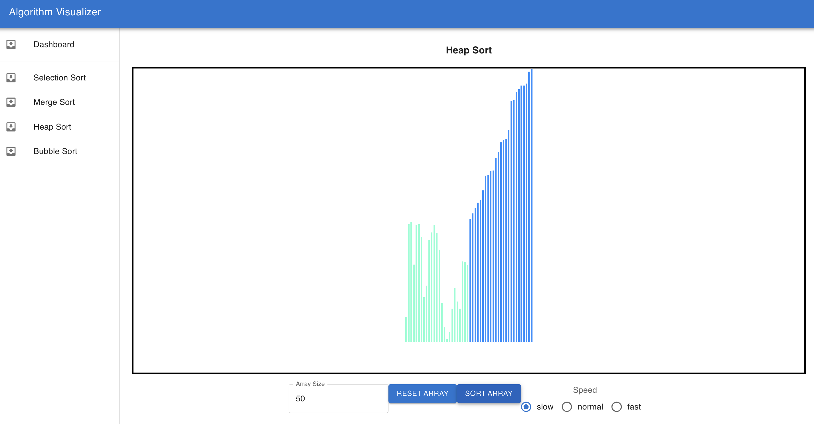

# Sorting Algorithm Visualizer

### Published site: [algorithm-visualizer](https://bsalinassanchez.github.io/algorithm-visualizer/)

### About The App

This sorting algorithm visualizer is meant to be used as a supplement to learning sorting algorithms. It helps build the user's intuition on how a sorting algorithm compares or swaps values at a time.

The user is able to create a custom-sized array with random values, select one of several sorting algorithms, and change the speed of the sorting visualization.

### Screenshots

### Technologies

I build this application using React Javascript, HTML, and CSS.

### Setup
- download or clone the repository 
- run `npm install`
- run `npm start` to run on local machine

### Status

There are currently only 4 sorting algorithms implemented. I plan on adding more sorting algorithms in the future. 

### License

MIT license @ bsalinassanchez
